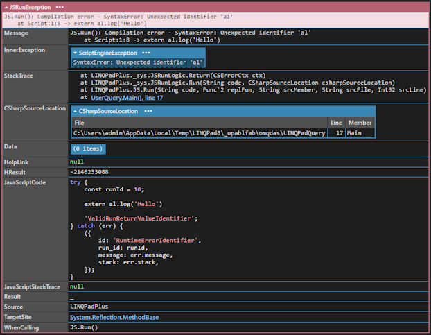

# LINQPadPlus

**LINQPadPlus** is a library for adding useful functionality to LINQPad.

## Install

- 📦 [NuGet](https://nuget.org/packages/LINQPadPlus): `dotnet add package LINQPadPlus`

## Features

- Collection on LINQPad samples to learn the library
- Surface JavaScript runtime and compilation errors as Exceptions
- Powerful HTML building blocks
- Designed with reactivity in mind
- Integration with [Tabulator](https://tabulator.info/) to display tables
- Upcoming: integration with [Plotly](https://plotly.com/javascript/)

## Usage

### Running JavaScript

```c#
JS.Run("external.log('Hello')");    // Hello
JS.Return("'abc'").Dump();          // abc

// same as above but this form is useful for more complex code
JS.Return("""
(function() {
    return 'abc'
})()
""");
```

Chances are you will write wrong JavaScript in LINQPad before writing correct one.
And this is where these functions will help you.
If you write incorrect code these will show you exactly what the issue is:
```c#
JS.Run("extern al.log('Hello')");
```


Notice that your code is wrapped in some boilerplate to catch the errors.

It handles:
- compilation errors
- runtime errors
- runtime errors in async code


## Using Tags (HTML)

```c#
t.Div.Dump()                                // create a div
t.Div.id("myid")                            // set Id
t.Div.cls("myclass")                        // set class (can be called multiple times)
t.Div.style("font-size:12px; color:blue")   // set styles (can be called multiple times)
t.Button.enable(false)                      // disabled button

// add children
public Tag this[params HtmlNode[] kids]

t.Label[
    t.Input                                 // other tag
        .attr("type", "checkbox"),          // set attributes
    "Checkbox",                             // text node
    new LINQPad.Controls.Span("text"),      // support LINQPad controls
    new DumpContainer("content")            // support LINQPad DumpContainer
].Dump();
```

### Add children
Use the index operator as a fluent method:
```c#
public Tag this[params HtmlNode[] kids]
```
The children can be:
- other tags
- strings
- LINQPad controls
- LINQPad dump containers